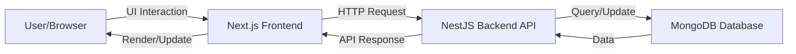
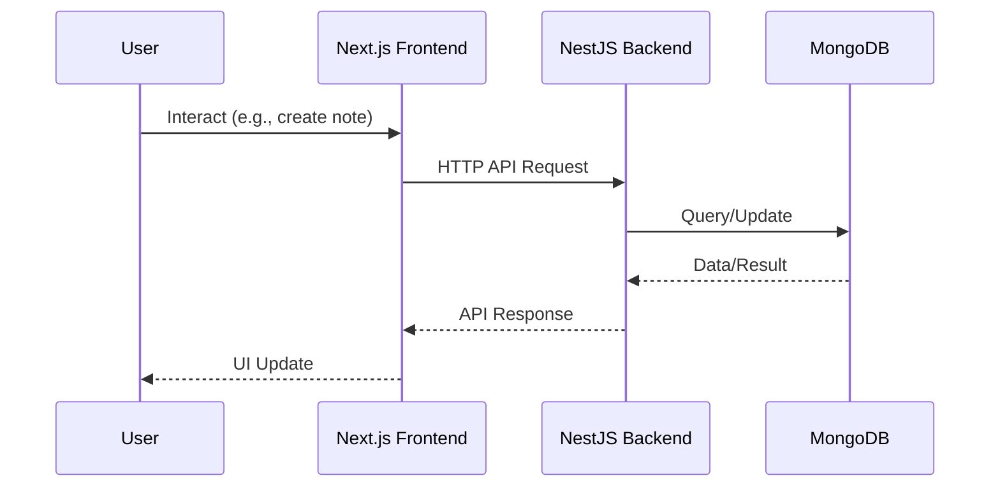

# System Architecture

## Overview

The application follows a three-tier architecture:

1. Frontend (Next.js)
2. Backend (NestJS API)
3. Database (MongoDB)

---

## Architecture Diagram (Mermaid)

---

## Components

### Frontend

* Built using Next.js (React framework)
* Handles user interface, routing, and user interactions
* Communicates with backend via HTTP requests (REST API)

### Backend

* Built using NestJS (Node.js framework)
* Handles business logic and validation
* Provides RESTful APIs
* Interacts with MongoDB

### Database

* MongoDB (NoSQL document database)
* Stores notes, comments, tags, and metadata

---

## Data Flow (Mermaid)

---

## Design Decisions

* Use of NoSQL for flexible schema
* Embedding comments within notes to reduce joins
* REST API for clear separation of concerns
* Next.js for SSR/SPA flexibility
* NestJS for modular, scalable backend
