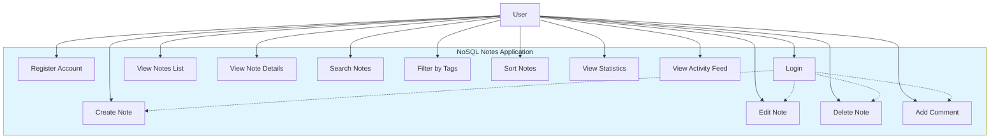
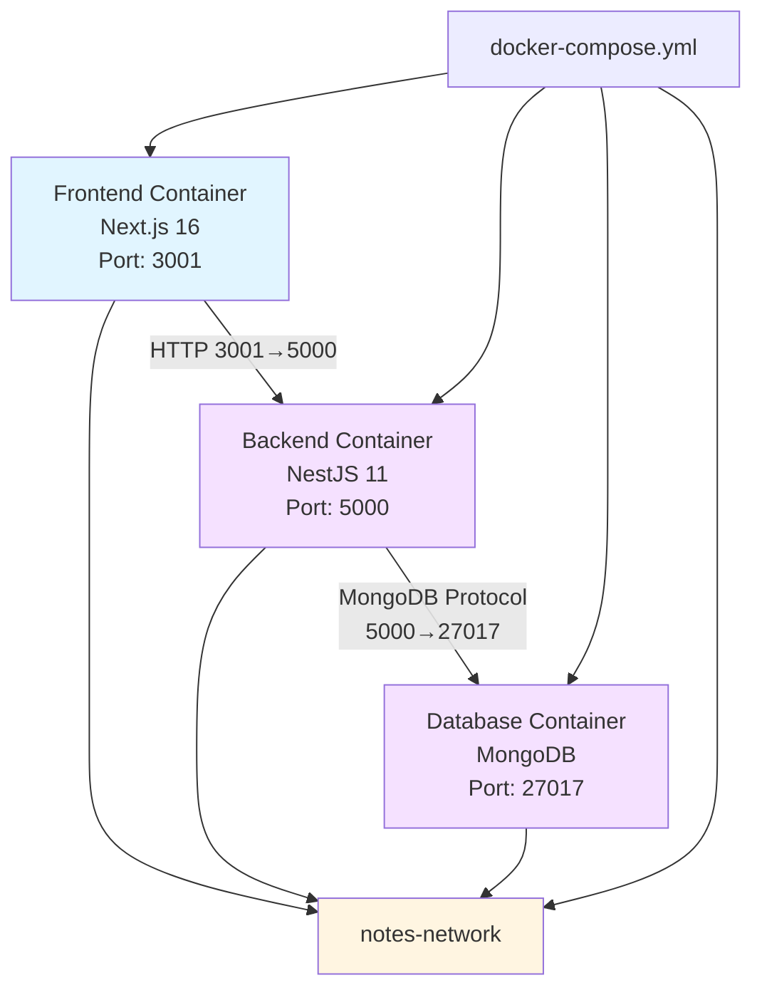
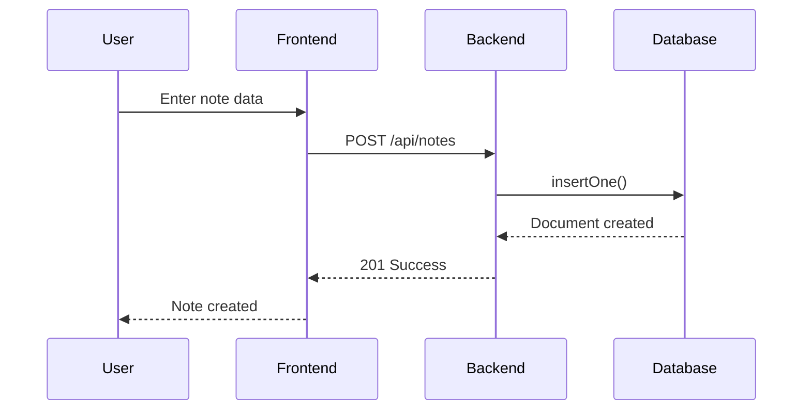
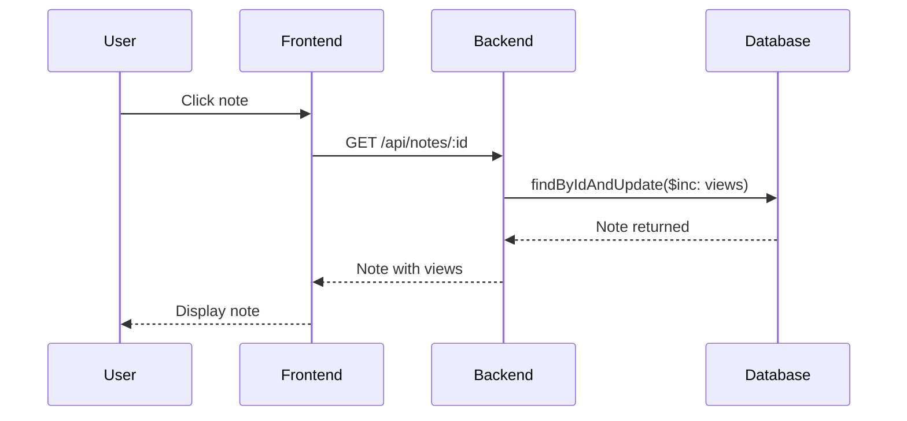
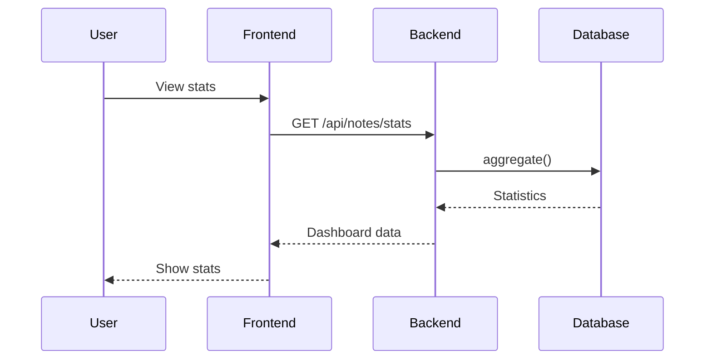
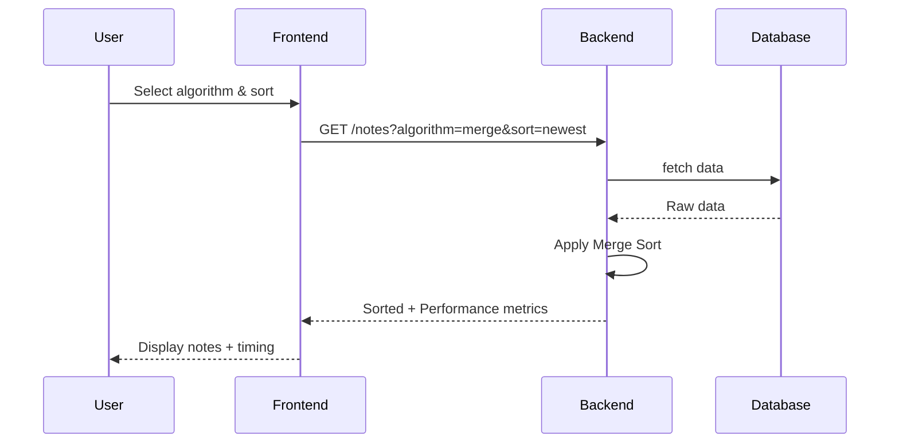
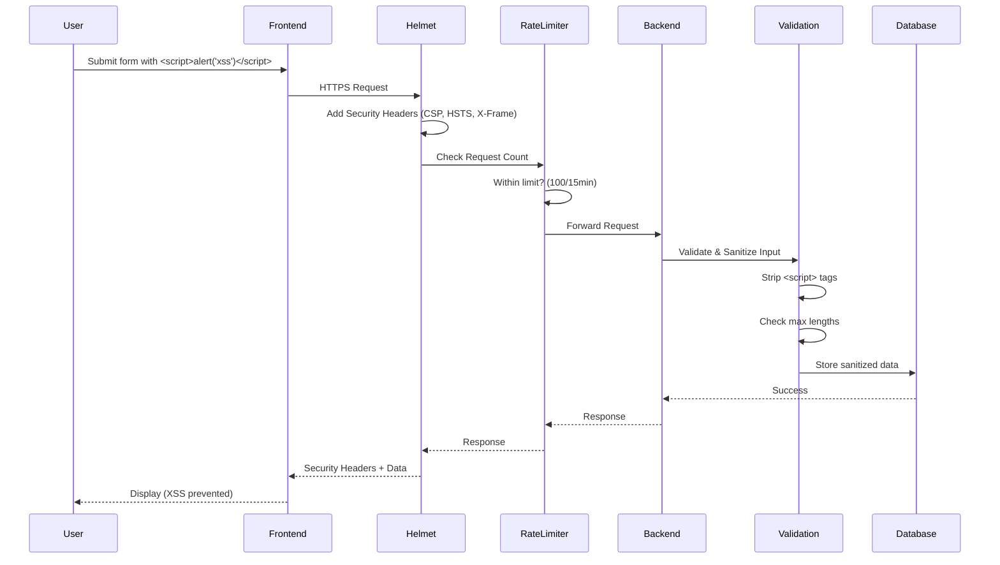
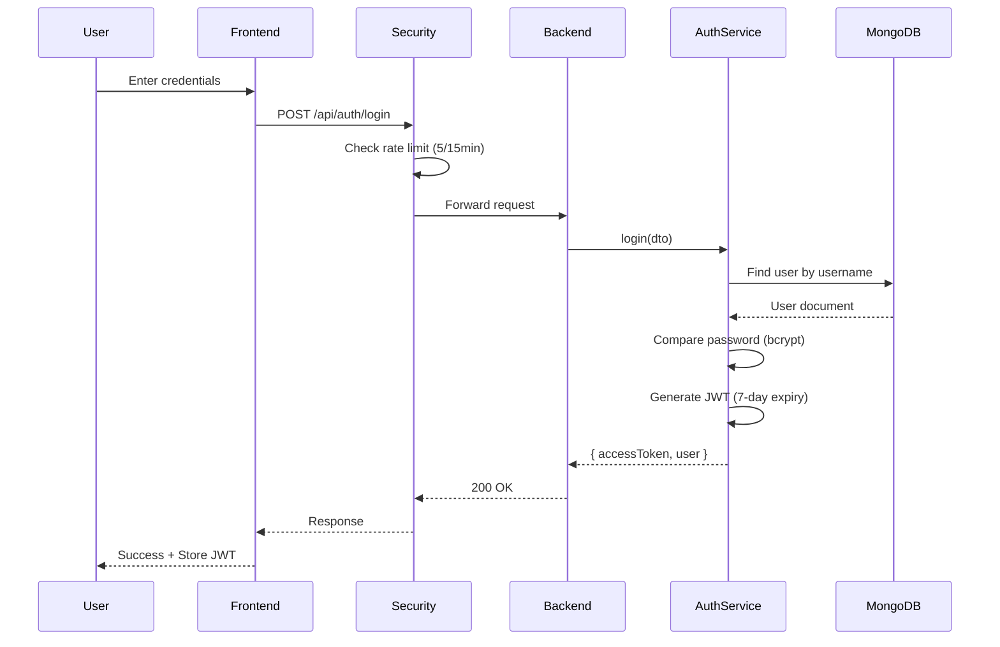
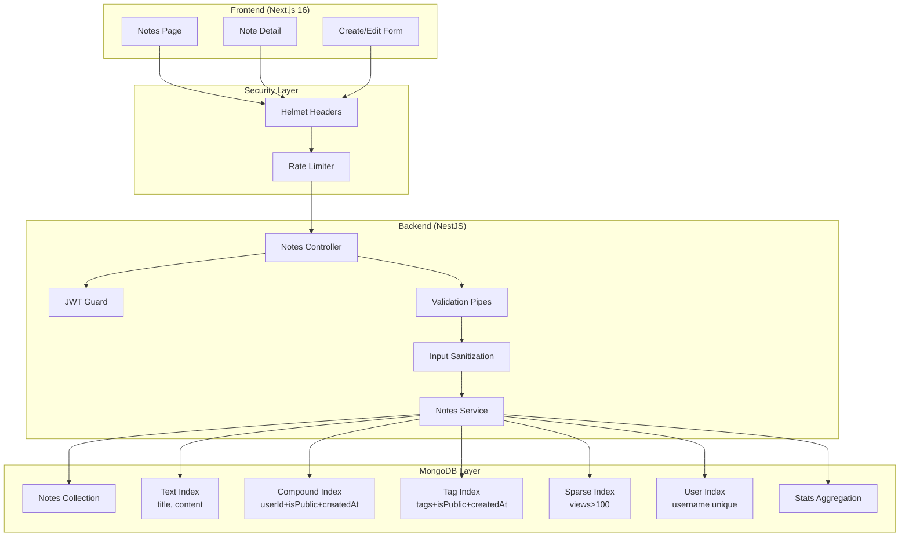
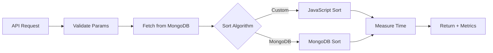

# NoSQL Notes Application - System Design

## Project Deliverables

This document addresses **Deliverable 2: System Design** - Architectural diagrams illustrating web application components and their interactions, with focus on NoSQL database integration.

---

## Use Case Diagram

Shows all user interactions with the system.



---

## Deployment Architecture

Shows Docker containers, ports, volumes, and networking.



---

## System Architecture

```mermaid
graph TD
    User[User] -->|HTTPS| Frontend
    Frontend -->|HTTP| SecurityLayer
    SecurityLayer -->|Filtered| Backend
    Backend -->|MongoDB| Database

    subgraph Frontend["Frontend (Next.js)"]
        Frontend[Web Browser Interface]
    end

    subgraph SecurityLayer["Security Layer"]
        Helmet[Helmet Headers<br/>CSP, HSTS, X-Frame]
        RateLimit[Rate Limiter<br/>100req/15min]
        AuthLimit[Auth Rate Limiter<br/>5req/15min]
    end

    subgraph Backend["Backend (NestJS)"]
        API[REST API]
        JWT[JWT Guard]
        Validation[Input Validation<br/>@Transform Sanitization]
        Service[Business Logic]
    end

    subgraph Database["Database (MongoDB)"]
        Collection[Notes Collection]
        Indexes[Compound & Text Indexes]
    end

    Helmet --> RateLimit
    RateLimit --> AuthLimit
    AuthLimit --> API
    API --> JWT
    JWT --> Validation
    Validation --> Service
```

---

## Component Interactions

### Create Note Flow



### View Note Flow (with view counter)



### Get Statistics Flow



### Sorting Algorithm Flow



### Security Flow (Defense in Depth)



### Authentication Flow (JWT)



### Component Diagram with Database Indexes



---

## Technology Stack

| Component      | Technology                           |
| -------------- | ------------------------------------ |
| Frontend       | Next.js 16, React 19, TanStack Query |
| Backend        | NestJS 11                            |
| Security       | Helmet, Express-Rate-Limit           |
| Database       | MongoDB                              |
| ODM            | Mongoose 9                           |
| Authentication | Passport JWT, bcrypt                 |

---

## API Endpoints

| Method | Endpoint                          | Description             |
| ------ | --------------------------------- | ----------------------- |
| GET    | /api/notes                        | List notes (paginated)  |
| GET    | /api/notes?sort=...&algorithm=... | Sort & filter notes     |
| GET    | /api/notes/:id                    | Get note (+ view count) |
| POST   | /api/notes                        | Create note             |
| PUT    | /api/notes/:id                    | Update note             |
| DELETE | /api/notes/:id                    | Delete note             |
| POST   | /api/notes/:id/comments           | Add comment             |
| GET    | /api/notes/stats                  | Get statistics          |
| GET    | /api/notes/activity               | Get activity feed       |
| GET    | /api/sort/algorithms              | Get sort algorithms     |
| POST   | /api/seed/notes/:count            | Seed random notes       |
| POST   | /api/seed/clear                   | Clear all notes         |
| GET    | /api/seed/count                   | Get note count          |

---

## Sorting Algorithms

| Algorithm   | Time           | Space    | Stable | Description                |
| ----------- | -------------- | -------- | ------ | -------------------------- |
| Merge Sort  | O(n log n)     | O(n)     | Yes    | Divide and conquer, stable |
| Quick Sort  | O(n log n) avg | O(log n) | No     | Fast average case          |
| Bubble Sort | O(n²)          | O(1)     | Yes    | Simple, educational        |
| MongoDB     | O(log n)       | O(1)     | Yes    | Database native            |

---

## Pagination & Performance

- **Pagination:** `?page=1&limit=10` (max 100)
- **Performance Metrics:** Returned in each response
  - Execution time (ms)
  - Algorithm name
  - Time complexity
  - Space complexity
  - Stability

---

## Data Flow with Performance Tracking


