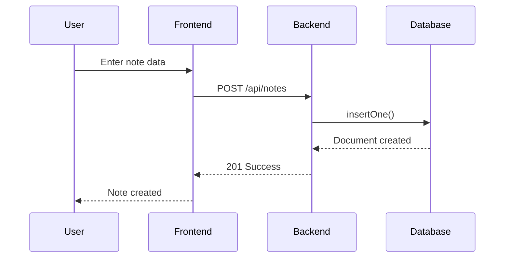
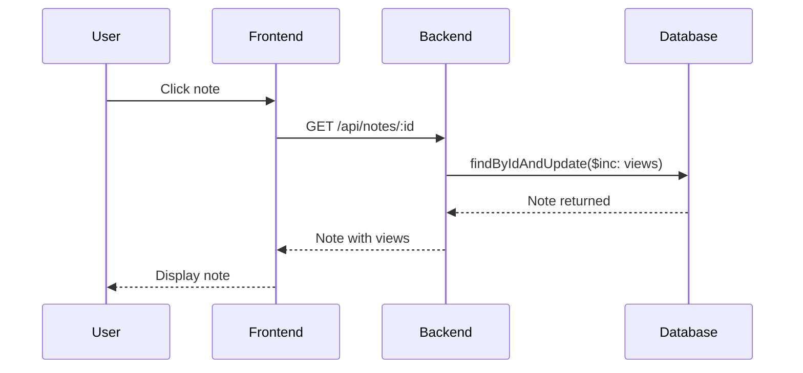
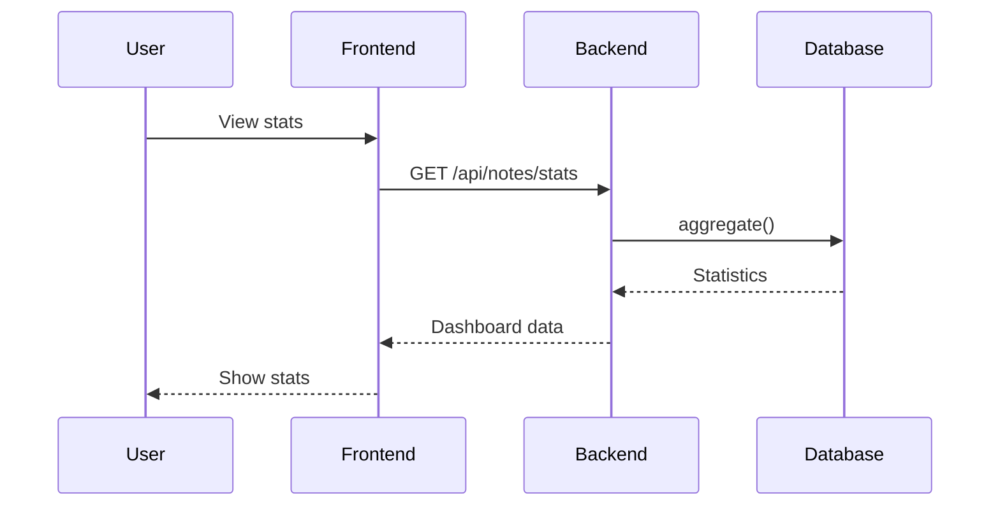
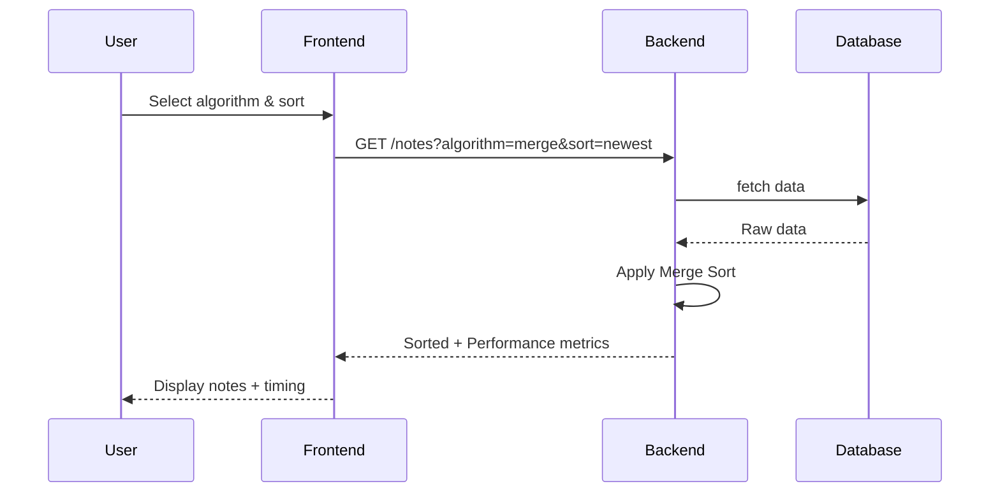
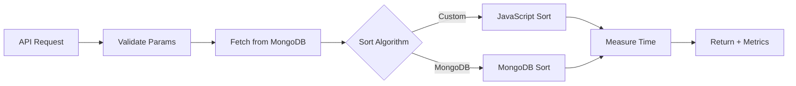

# NoSQL Notes Application - System Design

## Project Deliverables

This document addresses **Deliverable 2: System Design** - Architectural diagrams illustrating web application components and their interactions, with focus on NoSQL database integration.

---

## System Architecture

```mermaid
graph TD
    User[User] -->|HTTPS| Frontend
    Frontend -->|HTTP| Backend
    Backend -->|MongoDB| Database
    
    subgraph Frontend["Frontend (Next.js)"]
        Frontend[Web Browser Interface]
    end
    
    subgraph Backend["Backend (NestJS)"]
        API[REST API]
        Service[Business Logic]
    end
    
    subgraph Database["Database (MongoDB)"]
        Collection[Notes Collection]
    end
```

---

## Component Interactions

### Create Note Flow


### View Note Flow (with view counter)


### Get Statistics Flow


### Sorting Algorithm Flow


---

## Technology Stack

| Component | Technology |
|-----------|------------|
| Frontend | Next.js 16, React 19, TanStack Query |
| Backend | NestJS 11 |
| Database | MongoDB |
| ODM | Mongoose 9 |

---

## API Endpoints

| Method | Endpoint | Description |
|--------|----------|-------------|
| GET | /api/notes | List notes (paginated) |
| GET | /api/notes?sort=...&algorithm=... | Sort & filter notes |
| GET | /api/notes/:id | Get note (+ view count) |
| POST | /api/notes | Create note |
| PUT | /api/notes/:id | Update note |
| DELETE | /api/notes/:id | Delete note |
| POST | /api/notes/:id/comments | Add comment |
| GET | /api/notes/stats | Get statistics |
| GET | /api/notes/activity | Get activity feed |
| GET | /api/sort/algorithms | Get sort algorithms |
| POST | /api/seed/notes/:count | Seed random notes |
| POST | /api/seed/clear | Clear all notes |
| GET | /api/seed/count | Get note count |

---

## Sorting Algorithms

| Algorithm | Time | Space | Stable | Description |
|-----------|------|--------|--------|-------------|
| Merge Sort | O(n log n) | O(n) | Yes | Divide and conquer, stable |
| Quick Sort | O(n log n) avg | O(log n) | No | Fast average case |
| Bubble Sort | O(n²) | O(1) | Yes | Simple, educational |
| MongoDB | O(log n) | O(1) | Yes | Database native |

---

## Pagination & Performance

- **Pagination:** `?page=1&limit=10` (max 100)
- **Performance Metrics:** Returned in each response
  - Execution time (ms)
  - Algorithm name
  - Time complexity
  - Space complexity
  - Stability

---

## Data Flow with Performance Tracking

