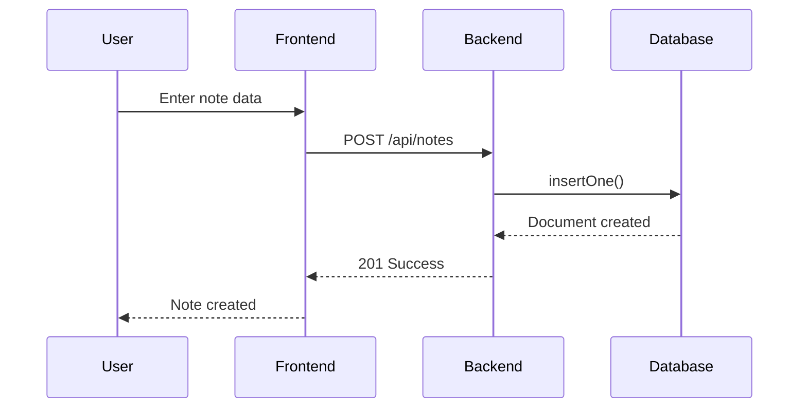
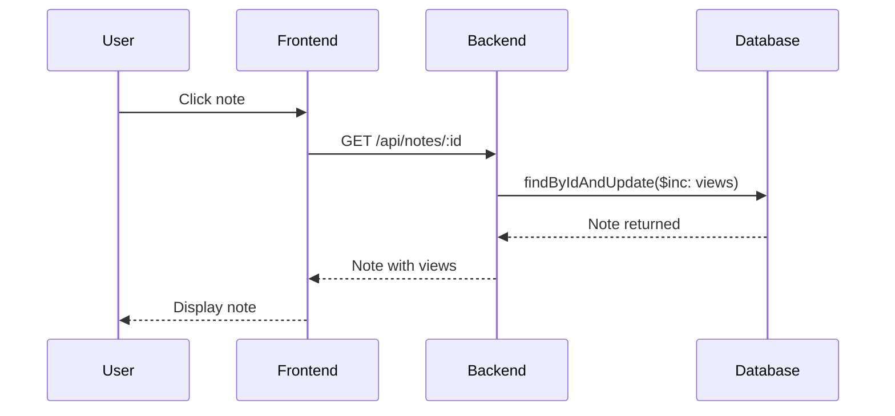
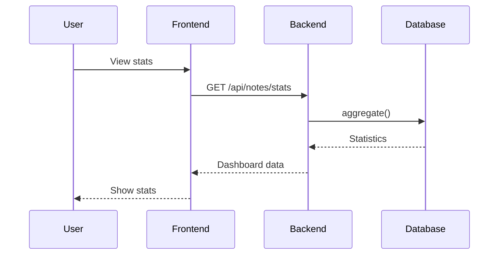

# NoSQL Notes Application - System Design

## Project Deliverables

This document addresses **Deliverable 2: System Design** - Architectural diagrams illustrating web application components and their interactions, with focus on NoSQL database integration.

---

## System Architecture

```mermaid
graph TD
    User[User] -->|HTTPS| Frontend
    Frontend -->|HTTP| Backend
    Backend -->|MongoDB| Database
    
    subgraph Frontend["Frontend (Next.js)"]
        Frontend[Web Browser Interface]
    end
    
    subgraph Backend["Backend (NestJS)"]
        API[REST API]
        Service[Business Logic]
    end
    
    subgraph Database["Database (MongoDB)"]
        Collection[Notes Collection]
    end
```

---

## Component Interactions

### Create Note Flow


### View Note Flow (with view counter)


### Get Statistics Flow


---

## Technology Stack

| Component | Technology |
|-----------|------------|
| Frontend | Next.js 16, React 19 |
| Backend | NestJS 11 |
| Database | MongoDB |
| ODM | Mongoose 9 |

---

## API Endpoints

| Method | Endpoint | Description |
|--------|----------|-------------|
| GET | /api/notes | List all notes |
| GET | /api/notes?sort=newest | Sort notes |
| GET | /api/notes/:id | Get note (+ view count) |
| POST | /api/notes | Create note |
| PUT | /api/notes/:id | Update note |
| DELETE | /api/notes/:id | Delete note |
| POST | /api/notes/:id/comments | Add comment |
| GET | /api/notes/stats | Get statistics |
| GET | /api/notes/activity | Get activity feed |