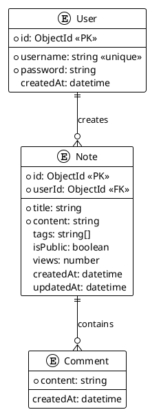

# Notes Application - Technical Documentation

## Project Overview

A full-stack notes application with user authentication, public/private notes management, and various sorting algorithms for performance analysis.

### Technology Stack

- **Backend**: NestJS with MongoDB (Mongoose)
- **Frontend**: Next.js 16 with React Query
- **Database**: MongoDB
- **Authentication**: JWT (JSON Web Tokens)

---

## Data Model

### Entities

#### User

```typescript
{
  _id: ObjectId,        // Primary key
  username: string,      // Unique, lowercase
  password: string,     // bcrypt hashed
  createdAt: Date,      // Auto-generated
  updatedAt: Date      // Auto-generated
}
```

#### Note

```typescript
{
  _id: ObjectId,        // Primary key
  userId: ObjectId,     // FK to User
  title: string,       // Required
  content: string,     // Required, Markdown supported
  tags: string[],       // Optional, max 10
  comments: Comment[], // Embedded array
  isPublic: boolean,  // Default: false (private)
  views: number,       // Default: 0
  createdAt: Date,     // Auto-generated
  updatedAt: Date     // Auto-generated
}
```

#### Comment (Embedded)

```typescript
{
  content: string,     // Required
  createdAt: Date     // Default: Date.now
}
```

### Relationships

```
User (1) ──────< (N) Note
Note (1) ──────< (N) Comment
```

---

## Backend API Endpoints

### Authentication

| Method | Endpoint             | Auth | Description        |
| ------ | -------------------- | ---- | ------------------ |
| POST   | `/api/auth/register` | No   | Register new user  |
| POST   | `/api/auth/login`    | No   | Login, returns JWT |

**Request Body:**

```json
{
  "username": "string",
  "password": "string"
}
```

**Response:**

```json
{
  "accessToken": "eyJhbG...",
  "user": {
    "id": "...",
    "username": "..."
  }
}
```

### Notes

| Method | Endpoint              | Auth        | Description                       |
| ------ | --------------------- | ----------- | --------------------------------- |
| GET    | `/api/notes`          | JWT         | List notes (public + own private) |
| GET    | `/api/notes/:id`      | No          | Get single note (if public)       |
| POST   | `/api/notes`          | JWT         | Create private note               |
| PUT    | `/api/notes/:id`      | JWT (owner) | Update note                       |
| DELETE | `/api/notes/:id`      | JWT (owner) | Delete note                       |
| GET    | `/api/notes/stats`    | No          | Get statistics                    |
| GET    | `/api/notes/activity` | No          | Recent activity                   |

**Query Parameters:**

- `tag`: Filter by tag
- `search`: Search in title/content (min 2 chars)
- `sort`: newest|oldest|alpha|views|comments
- `algorithm`: merge|quick|bubble|mongo
- `page`: Page number
- `limit`: Items per page

**Response (GET /notes):**

```json
{
  "data": [
    {
      "id": "...",
      "userId": "...",
      "username": "...",
      "title": "...",
      "content": "...",
      "tags": [],
      "isPublic": true,
      "createdAt": "2026-...",
      "updatedAt": "2026-...",
      "commentCount": 0,
      "views": 0
    }
  ],
  "pagination": {
    "page": 1,
    "limit": 10,
    "total": 1,
    "totalPages": 1,
    "hasNext": false,
    "hasPrev": false
  },
  "performance": {
    "algorithmId": "merge",
    "algorithmName": "Merge Sort",
    "executionTimeMs": 12.0,
    "timeComplexity": "O(n log n)",
    "spaceComplexity": "O(n)",
    "stable": true
  }
}
```

### Create/Update Note Request Body:

```json
{
  "title": "string",
  "content": "string (Markdown)",
  "tags": ["tag1", "tag2"],
  "isPublic": false
}
```

---

## Frontend Pages

| Route             | Description                   |
| ----------------- | ----------------------------- |
| `/`               | Home                          |
| `/notes`          | Notes list with search/filter |
| `/notes/new`      | Create note (auth required)   |
| `/notes/:id`      | Note detail                   |
| `/notes/:id/edit` | Edit note (owner only)        |
| `/login`          | Login page                    |
| `/register`       | Register page                 |
| `/stats`          | Statistics                    |

---

## Environment Variables

### Backend (.env)

```
PORT=5000
MONGODB_URI=mongodb://localhost:27017/notes-db
JWT_SECRET=your-secret-key
CORS_ORIGIN=http://localhost:3001
```

### Frontend (.env)

```
NEXT_PUBLIC_API_URL=http://localhost:5000
```

---

## Key Implementation Details

### Security

#### 1. Authentication & Authorization

- **Password Hashing**: bcrypt with 10 salt rounds for secure password storage
- **JWT Authentication**: 7-day token expiration with secure payload signing
- **Route Protection**:
  - Public notes: Read-only access for all users
  - Private notes: Owner-only access for read/edit/delete operations
- **JWT Strategy**: Passport JWT with bearer token validation on protected routes

#### 2. Input Validation & Sanitization

- **DTO Validation**: class-validator decorators enforce type safety and constraints
- **Input Sanitization**: `@Transform` decorators in DTOs remove malicious content:
  ```typescript
  @Transform(({ value }: { value: string }) => sanitizeInput(value))
  title!: string;
  ```
- **Sanitization Rules**:
  - Removes `<script>` tags and JavaScript protocol handlers
  - Strips event handler attributes (`onclick`, `onload`, etc.)
  - Trims whitespace and normalizes input
- **Tag Validation**: Custom `@IsTag` validator ensures tags contain only alphanumeric characters, hyphens, and underscores

#### 3. XSS & Injection Prevention

- **Schema-Level Validation**: Comment entity has built-in regex validation to reject script injection attempts
- **Max Length Constraints**:
  - Title: 200 characters max
  - Content: 50,000 characters max
  - Comments: 1,000 characters max
  - Tags: 10 tags maximum per note

#### 4. Rate Limiting & DDoS Protection

- **General Rate Limiting**: 100 requests per 15 minutes per IP
- **Auth Endpoint Protection**: Stricter 5 attempts per 15 minutes for login/register
- **Skip Successful Requests**: Successful logins don't count against rate limits
- **Standard Headers**: RFC-compliant `RateLimit-*` headers for client awareness

#### 5. Security Headers (Helmet)

```javascript
helmet({
  contentSecurityPolicy: {
    directives: {
      defaultSrc: ["'self'"],
      styleSrc: ["'self'", "'unsafe-inline'"],
      scriptSrc: ["'self'"],
      imgSrc: ["'self'", "data:", "https:"],
    },
  },
});
```

- **Content Security Policy**: Restricts resource loading to trusted sources
- **X-Frame-Options**: Prevents clickjacking attacks
- **X-Content-Type-Options**: Prevents MIME type sniffing
- **Strict-Transport-Security**: Enforces HTTPS connections

#### 6. CORS Configuration

- Whitelist-based origin validation
- Credentials-enabled for authenticated requests
- Restricted HTTP methods (GET, POST, PUT, PATCH, DELETE, HEAD)
- Specific allowed headers for API communication

#### 7. Database Security

- **Parameterized Queries**: Mongoose prevents NoSQL injection
- **Credential Masking**: Database URIs are sanitized in logs (passwords replaced with \*\*\*\*)
- **Connection Security**: MongoDB connection strings support TLS/SSL
- **Index-Based Queries**: All user-facing queries use indexed fields to prevent full collection scans

### Sorting Algorithms

| Algorithm      | Time Complexity | Space Complexity | Stable  |
| -------------- | --------------- | ---------------- | ------- |
| Merge Sort     | O(n log n)      | O(n)             | Yes     |
| Quick Sort     | O(n log n) avg  | O(log n)         | No      |
| Bubble Sort    | O(n²)           | O(1)             | Yes     |
| MongoDB Native | O(log n)        | O(1)             | Depends |

### Indexes

```javascript
// User
{ username: 1 }  // unique

// Note - Single Field
{ title: 'text', content: 'text' }  // text search
{ tags: 1 }                          // tag filtering
{ createdAt: -1 }                    // date sorting
{ userId: 1 }                        // user queries
{ isPublic: 1 }                      // visibility filter

// Note - Compound Indexes
{ userId: 1, isPublic: 1, createdAt: -1 }  // user's notes by visibility
{ tags: 1, isPublic: 1, createdAt: -1 }    // tag search with visibility

// Note - Sparse/Partial Index
{ views: -1 }  // partialFilterExpression: { views: { $gt: 100 } }
               // Only indexes popular notes for leaderboard
```

---

## Running the Application

### Backend

```bash
cd apps/backend
npm install
npm run start:dev  # Runs on port 5000
```

### Frontend

```bash
cd apps/frontend
npm install
npm run dev  # Runs on port 3001
```

---

## File Structure

```
apps/
├── backend/
│   └── src/
│       ├── auth/           # JWT authentication
│       │   ├── auth.controller.ts
│       │   ├── auth.service.ts
│       │   ├── auth.module.ts
│       │   ├── jwt.strategy.ts
│       │   └── jwt-auth.guard.ts
│       ├── notes/          # Notes management
│       │   ├── notes.controller.ts
│       │   ├── notes.service.ts
│       │   ├── notes.module.ts
│       │   ├── dto/
│       │   └── entities/
│       ├── entities/       # MongoDB schemas
│       │   ├── user.entity.ts
│       │   ├── note.entity.ts
│       │   └── comment.entity.ts
│       ├── sort/           # Sorting algorithms API
│       └── utils/         # Sorting implementations
│
└── frontend/
    └── app/
        ├── notes/         # Notes pages
        ├── login/        # Auth pages
        ├── register/
        └── stats/
        └── lib/
            └── api/      # API client
```

---

## PlantUML Data Model Diagram



---

## Dependencies

### Backend

- @nestjs/core
- @nestjs/common
- @nestjs/mongoose
- @nestjs/jwt
- @nestjs/passport
- passport
- passport-jwt
- bcrypt
- mongoose
- class-validator
- class-transformer

### Frontend

- next
- react
- @tanstack/react-query
- react-markdown
- react-markdown-editor-lite
