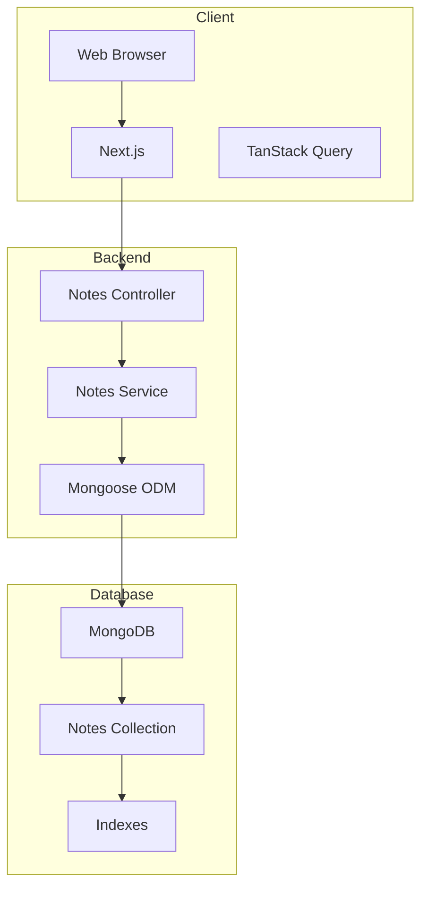
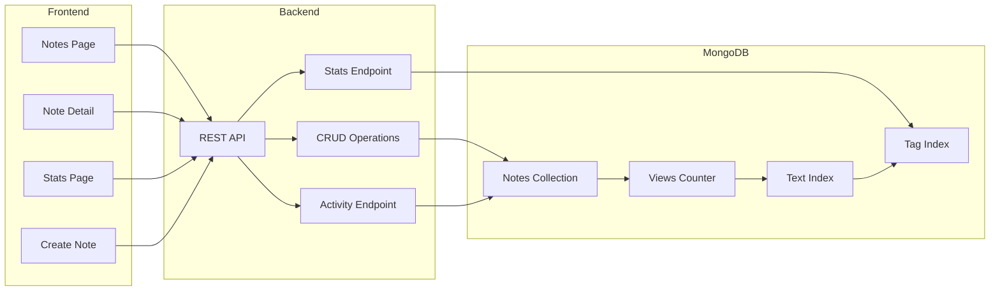
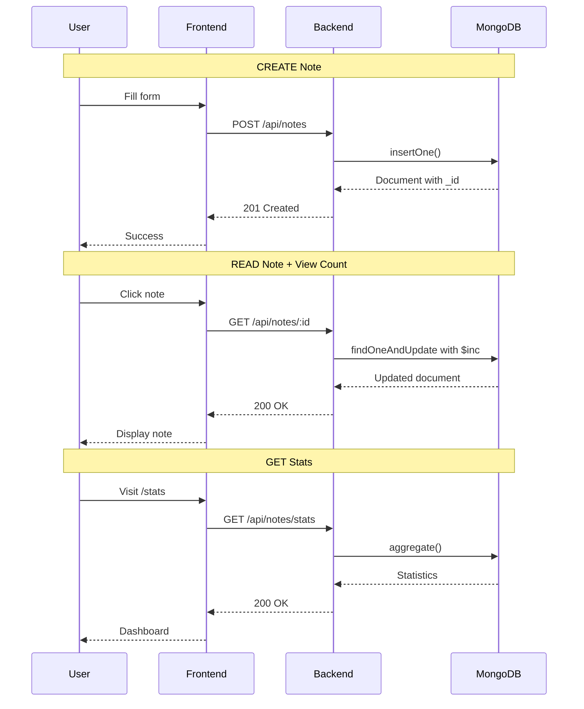
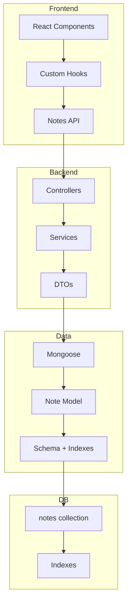
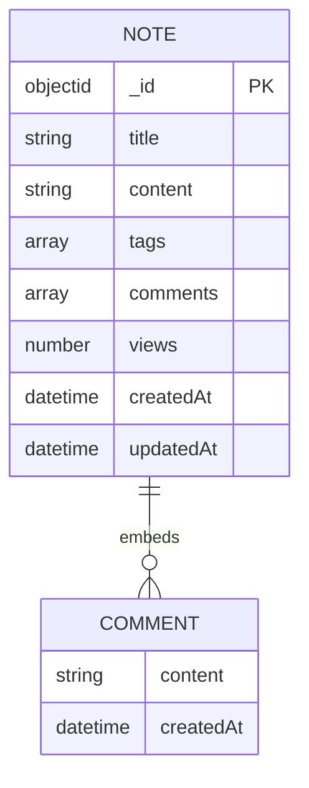

# NoSQL Notes Application - Architecture Diagram

## System Architecture

---

## Complete Architecture with All Features

---

## Data Flow Sequence Diagram

### Create Note and View Note Operations

---

## Component Diagram

---

## Database Schema

---

## MongoDB Operations Summary

| Operation | MongoDB Method | Description |
|-----------|-------------|------------|
| Create | insertOne | New note document |
| Read All | find | Get all notes |
| Read One | findById + $inc | Get note, increment views |
| Update | findByIdAndUpdate | Update note |
| Delete | findByIdAndDelete | Delete note |
| Comment | $push | Add comment to array |
| Stats | aggregate | Compute statistics |
| Search | Text Index | Full-text search |